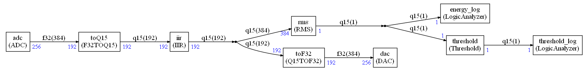
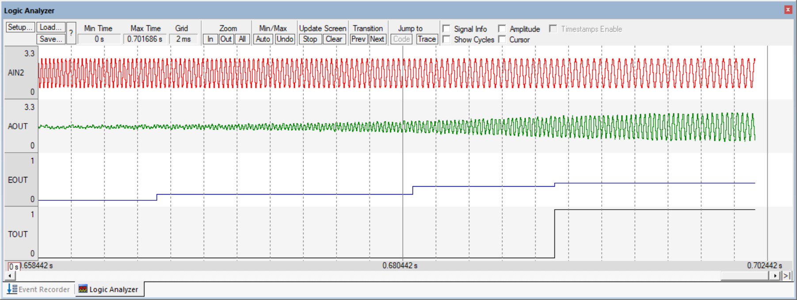

# README

**Work in progress.**

## Introduction

It is the original uVision `DSP_App` demo converted to CMSIS-DSP Compute Graph.

The implemented graph is:

When the application is running in uVision, you should see:

The generated signal can be changed by using a toolbox window displayed in uVision.

The filter will show an attenuation for some frequencies and not others.

## Changes compared to original version

### Filter nodes

The `IIR` (or `FIR`)  nodes are just wrappers around the implementation of the original demo files : `DSP_FIR.c` and `DSP_IIR.c`

As consequence, those wrappers have no argument to specify the filter coefficients since they are hard coded in the original filters. 

A future version may use a more customizable wrapper.

### `ADC` / `DAC` nodes

The `DAC` / `ADC` data is coming from the `TIMER2_IRQHandler` in `DSP_App.c`

The original application was containing several cases (controlled with `#if`) to select a format `f32`, `q31`,`q15`. But the original sample was always `f32`.

This version is extracting the conversion that is now part of the graph and made explicit. There is no more the need of compilation flags to select the data format. But the graph needs to be regenerated with another data format using the python script `graph.py`

Same to switch between IIR or FIR : the graph needs to be regenerated.

### DSP block lengths

The original version is using 256 samples for all the blocks. Here, to demonstrate the flexibility introduced with the compute graph, all the blocks (except sink / source) are using 192 samples.

It introduces an additional latency in the system since sometime the scheduling is requiring 2 calls to the source or 2 calls to the sink.

This is handled thanks to the `ADC` / `DAC` nodes that are connected to the interrupt handler through queues. The depth of the queue is controlled by `AUDIO_QUEUE_DEPTH` in the file `globalCGSettings.h`. This value must be coherent with the generated scheduling to avoid overflow or underflow in the sources / sinks.

This latency can be analyzed by using a compute graph doing nothing (`adc` connected directly to the `dac`) and using the square signal generator in the toolbox.

In the previous picture, one can see that the output signal is delayed from the input by 3 DSP packets.

The `AUDIO_QUEUE_DEPTH` is 3 for this example.

`AUDIO_QUEUE_DEPTH` must always be >= 2 because when the system starts you must be able to generate a packet although you have not received the first one needed to start the computation. A first dummy packet is used.

Then, as soon as you have received the first DSP packet, the computation is starting but at same time the system is also starting to generate the second output packet.

So, the first useful packet resulting from the computation is the 3rd packet generated on the output : a delay of 2 packets compared to the input.

In case where the scheduling in calling the source or sink several time in sequence, you have additional latencies like in the example above where the total latency is not 2 but 3.

