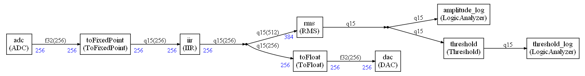
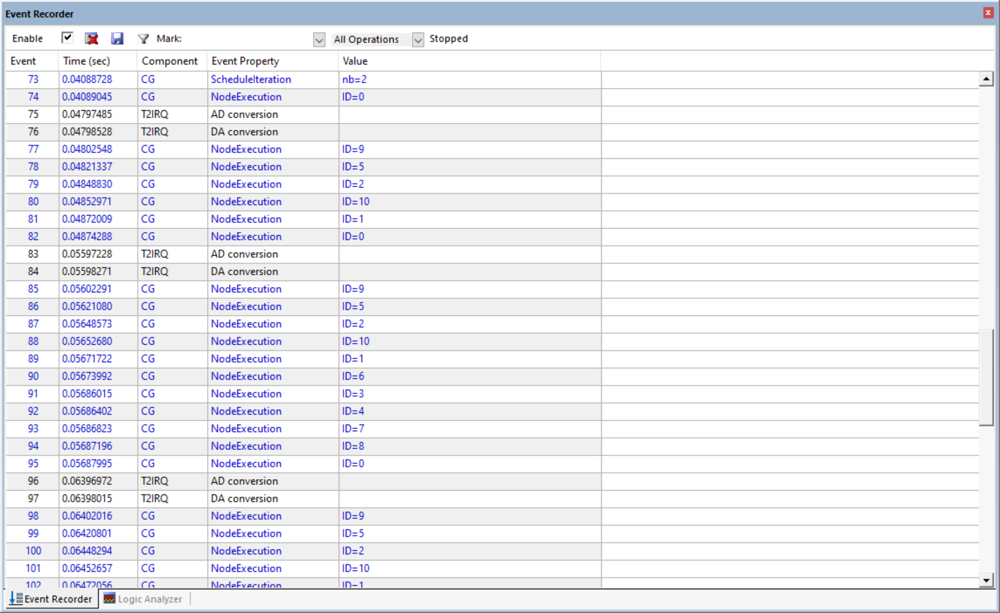
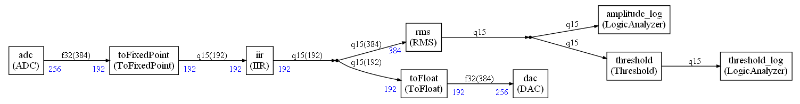

# CMSIS-Stream-PoC

This is an example project showing the usage of the CMSIS-Stream software component.

# Introduction

## The DSP compute graph

It is the original uVision `DSP_App` demo converted to [CMSIS-DSP Compute Graph](https://github.com/ARM-software/CMSIS-DSP/tree/main/ComputeGraph).

The implemented graph is:

The filter will show an attenuation for some frequencies and not others.

`EOUT` is the amplitude of the filtered signal (root mean square with DC offset removed).

`TOUT` is the comparison with a threshold to detect the presence of a specific frequency band in the signal.

The nodes in the graph are:

* `adc` : Get the input signal data from the timer interrupt
* `toFixedPoint` : Convert samples to `q15_t`
* `iir` : The IIR filter (can be replaced by the FIR by changing `graph.py`)
* `toFloat` : convert sample to `float32_t`
* `dac` : Generate the output signal for use in the timer interrupt
* `rms` : Compute the root mean square on a window of sample. The DC offset is removed before the computation
* `threshold` : Compare the value with a threshold. Return `0x7FFF` when input value `>=` to the threshold. Otherwise return `0`.
* `amplitude_log` : Write to a global variable monitored by the logic analyzer
* `threshold_log` : Write to a global variable monitored by the logic analyzer

## Running the application

### LogicAnalyzer

When the application is running in uVision, you should see:

The generated signal can be changed by using a toolbox window displayed in uVision:

### EventRecorder

The event recorder window displays Compute graph events and timer events:

* Start of a new schedule iteration
* Execution of a compute graph node
* AD conversion in timer interrupt
* DA conversion in timer interrupt

This trace can be used to track real-time issues. 

## Changes compared to original version

### Filter nodes

The `IIR` (or `FIR`)  nodes are just wrappers around the implementation of the original demo files : `DSP_FIR.c` and `DSP_IIR.c`

As consequence, those wrappers have no argument to specify the filter coefficients since they are hard coded in the original filters. 

A future version may use a more customizable wrapper.

### `ADC` / `DAC` nodes

The `DAC` / `ADC` data is coming from the `TIMER2_IRQHandler` in `DSP_App.c`

The original application was containing several cases (controlled with `#if`) to select a format `f32`, `q31`,`q15`. But the original sample was always `f32`.

This version is extracting the conversion that is now part of the graph and made explicit. There is no more the need of compilation flags to select the data format. But the graph needs to be regenerated with another data format using the python script `graph.py`

Same to switch between IIR or FIR : the graph needs to be regenerated.

### DSP block lengths

The original version is using 256 samples for all the blocks. To demonstrate the flexibility introduced with the compute graph, there is a different graph where all blocks (except sink / source) are using 192 samples. (graph described with the script `graph_with_higher_latency.py`)

It introduces an additional latency in the system since sometime the scheduling is requiring 2 calls to the source or 2 calls to the sink.

This is handled thanks to the `ADC` / `DAC` nodes that are connected to the interrupt handler through queues. The depth of the queue is controlled by `AUDIO_QUEUE_DEPTH` in the file `globalCGSettings.h`. This value must be coherent with the generated scheduling to avoid overflow or underflow in the sources / sinks.

This latency can be analyzed by using a compute graph doing nothing (`adc` connected directly to the `dac`) and using the square signal generator in the toolbox.

In the previous picture, one can see that the output signal is delayed from the input by 3 DSP packets.

The `AUDIO_QUEUE_DEPTH` is 3 for this example.

`AUDIO_QUEUE_DEPTH` must always be >= 2 because when the system starts you must be able to generate a packet although you have not received the first one needed to start the computation. A first dummy packet is used.

Then, as soon as you have received the first DSP packet, the computation is starting but at same time the system is also starting to generate the second output packet.

So, the first useful packet resulting from the computation is the 3rd packet generated on the output : a delay of 2 packets compared to the input.

In case where the scheduling in calling the source or sink several time in sequence, you have additional latencies like in the example above where the total latency is not 2 but 3.

# Python scripts

## Plotting filter transfer function

In below plots, the gray area represents the frequencies covered by the sweep sine and the red vertical line representes the middle of this area.

`python iir_filter_design.py -p`

`python fir_filter_design.py -p`

## Generating filter coefficients

`python iir_filter_design.py` creates `DSP_IIR.c`

`python fir_filter_design.py` creates `DSP_FIR.c`

# Generating graphs

From the `ComputeGraph` folder do:

`python graph.py` to generate the simpler DSP graph with minimum latency

`python graph_with_higher_latency.py` to generate a graph with higher latency

`python graph_latency_study.py` to generate a graph to study the latency

Above commands are generating `ComputeGraph/dsp_scheduler.cpp` and also a graphviz file for graphical representation:

* `ComputeGraph/Pictures/graph.dot`
* `ComputeGraph/Pictures/graph_with_higher_latency.dot`
* `ComputeGraph/Pictures/graph_latency_study.dot`

A `dot` file can be converted to a `png` using the graphviz command `dot`:

`dot -Tpng -o Pictures\graph.png Pictures\graph.dot`

The python scripts can take some options:

`python graph.py --fir` to use a FIR instead of IIR

`python graph.py --f32` to use `float` instead of `q15_t` for the processing.

